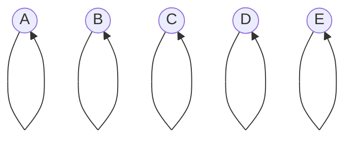
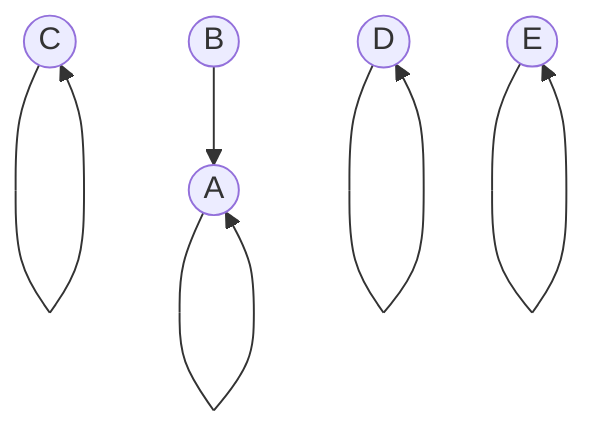
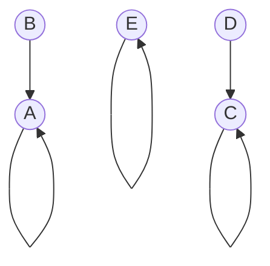
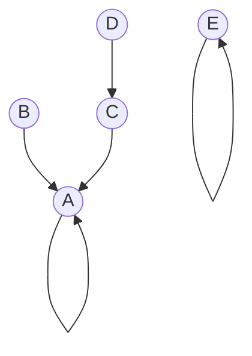

# Union Find: Structure and Basic Operations

## Introduction
Union Find, also known as Disjoint Set Union (DSU), is a data structure that keeps track of elements partitioned into disjoint (non-overlapping) sets. It provides two primary operations:

1. **Union**: Merge two sets
2. **Find**: Determine which set an element belongs to

## Structure

### Elements and Sets
- Each element is initially in its own set
- Sets are represented by a representative element (often called the "parent" or "root")

### Tree-like Structure
- Elements in a set form a tree-like structure
- The root of the tree is the set's representative
- Other elements point to their parent in the tree

## Basic Operations

### Find Operation
- Determines which set an element belongs to
- Follows parent pointers until reaching the root
- Returns the root (representative) of the set

### Union Operation
- Merges two sets
- Typically implemented by making the root of one set point to the root of the other

## Example Diagrams

Let's visualize these concepts with some diagrams. We'll use circles to represent elements, with arrows pointing to their parents. The root of each set will have a self-pointing arrow.

Initial state (5 elements, each in its own set):

After Union(A, B):

After Union(C, D):

After Union(A, C):

Example Find operations:
- Find(B) would return A
- Find(D) would also return A (following the path D -> C -> A)
- Find(E) would return E

## Key Points to Emphasize
1. The structure is dynamic and changes with each Union operation
2. Find operations do not modify the structure
3. The efficiency of Union Find depends on how we implement these operations (to be covered in future lessons)
4. Union Find is particularly useful in problems involving connected components, such as in graph theory

## Practical Applications
- Kruskal's algorithm for Minimum Spanning Trees
- Image processing (connected component labeling)
- Network connectivity
- Percolation theory