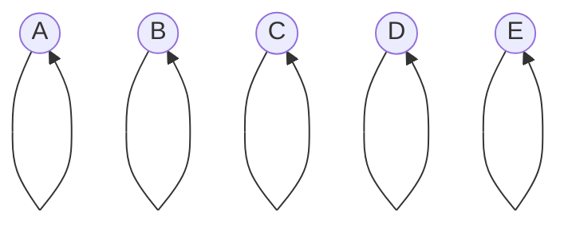
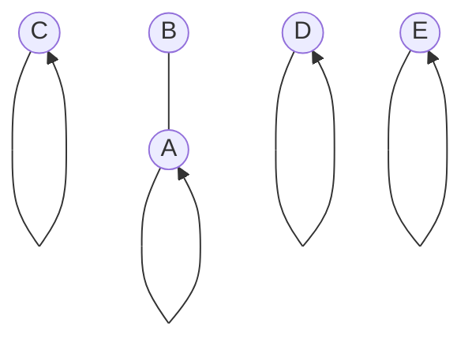
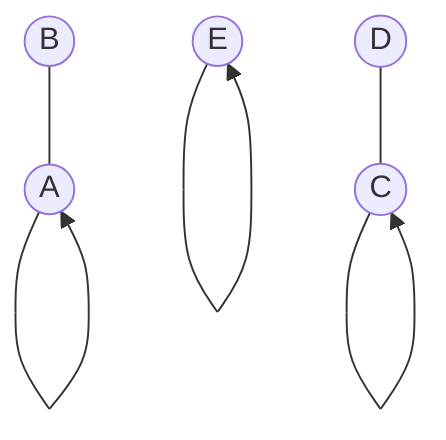
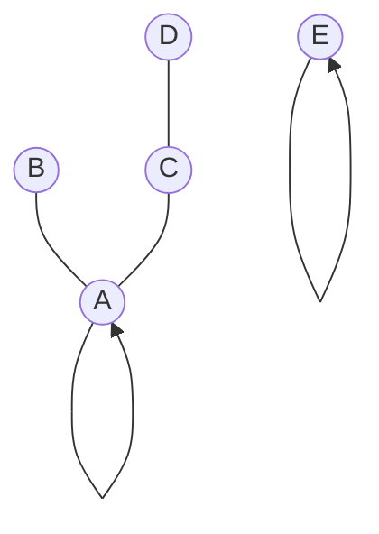

# Union Find: Structure and Basic Operations

## Introduction
Union Find, also known as Disjoint Set Union (DSU), is a data structure that keeps track of elements partitioned into disjoint (non-overlapping) sets. These sets are known as "connected components." Union Find provides two primary operations:

1. **Union**: Merge two sets
2. **Find**: Determine which set an element belongs to

## Structure

### Elements and Sets
- Each element or "node" is initially in its own exclusive connected component.
- When `union(a,b)` is invoked, the two sets containing a and b are merged into a single set.
- `find(a)` returns `true` if a and b are in the same set, and `false` otherwise.

## Example Diagrams

Let's visualize these concepts with some diagrams. We'll use circles to represent elements, with arrows pointing to their parents. The root of each set will have a self-pointing arrow.

Initial state (5 elements, each in its own set):

After Union(A, B):

After Union(C, D):

After Union(A, C):

Example Find operations:
- `find(A, B)` returns `true`
- `find(A, D)` returns `true`
- `find(A, E)` returns `false`
-  As always `find(A, A)` returns `true`

## Key Points to Emphasize
1. The structure is dynamic and changes with each Union operation
2. Find operations do not modify the structure
3. The efficiency of Union Find depends on how we implement these operations (coming soon!)
4. Union Find is particularly useful in problems involving connected components, such as in graph theory

## Practical Applications
- Kruskal's algorithm for Minimum Spanning Trees
- Image processing (connected component labeling)
- Network connectivity
- Percolation theory