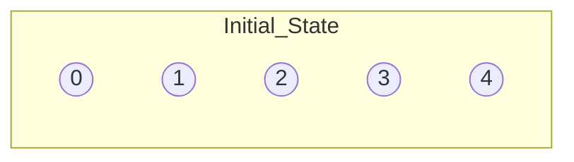
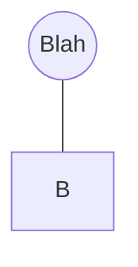

# Union-Find Algorithms: Quick Find, Quick Union, and Weighted Quick Union

## Introduction

The Union-Find problem, also known as the Disjoint Set problem, is a fundamental data structure used in various algorithms, including Kruskal's algorithm for finding the minimum spanning tree of a graph. We'll explore three approaches to solving this problem: Quick Find, Quick Union, and Weighted Quick Union with Path Compression.

## 1. Quick Find

Quick Find is the simplest approach to the Union-Find problem. It maintains an array where the index represents the connected component that contains that element.

### Union Operation
The `union(p, q)` operation sets the connected component of `p` to the connected component of `q`. This is achieved by iterating through the array and updating all elements with the same value as `p` to the value of `q`.

### Find Operation
The `find(p,q)` operation checks if the connected components of `p` and `q` are the same by comparing the values at the respective indices.

### Example:

```python
class QuickFind:
    def __init__(self, n):
        self.id = list(range(n))
    
    def find(self, p):
        return self.id[p]
    
    def union(self, p, q):
        pid, qid = self.id[p], self.id[q]
        for i in range(len(self.id)):
            if self.id[i] == pid:
                self.id[i] = qid
```

## 2. Quick Union

Quick Union uses a tree structure to represent sets. Each element points to its parent, and the root of the tree represents the connected component. The `find(p)` operation follows parent pointers until it reaches the root, while the `union(p, q)` operation attaches the root of one tree to the root of another.

**Example Diagrams are temporarily innacurate** (sorry)
### Example:
1. **Initial State**: Each element is its own root.

Parent Array:

| Index | 0 | 1 | 2 | 3 | 4 |
|-------|---|---|---|---|---|
| Value | 0 | 1 | 2 | 3 | 4 |


2. **After Union(2,3)**: Attach the root of 2 to the root of 3.

### Example:

```python
class QuickUnion:
    def __init__(self, n):
        self.parent = list(range(n))
    
    def find(self, p):
        while p != self.parent[p]:
            p = self.parent[p]
        return p
    
    def union(self, p, q):
        root_p, root_q = self.find(p), self.find(q)
        if root_p != root_q:
            self.parent[root_p] = root_q
```

### Tree Diagram:

```
Initial state:     After union(2,3):   After union(1,3):
0 1 2 3 4           0 1 2 3 4           0 1 2 3 4
│ │ │ │ │           │ │ │ │ │           │ │ │ │ │
0 1 2 3 4           0 1 3 3 4           0 3 3 3 4
                        │                 │
                        2                 1 2
```

## 3. Weighted Quick Union with Path Compression

This approach improves Quick Union by keeping track of the size of each tree and always attaching the smaller tree to the larger one. Path compression flattens the tree structure during find operations.

### Operations:

- **Find**: O(log N) - Follow parent pointers to the root, compressing the path along the way.
- **Union**: O(log N) - Attach the root of the smaller tree to the root of the larger tree.

### Example:

```python
class WeightedQuickUnionPC:
    def __init__(self, n):
        self.parent = list(range(n))
        self.size = [1] * n
    
    def find(self, p):
        root = p
        while root != self.parent[root]:
            root = self.parent[root]
        while p != root:
            next_p = self.parent[p]
            self.parent[p] = root
            p = next_p
        return root
    
    def union(self, p, q):
        root_p, root_q = self.find(p), self.find(q)
        if root_p == root_q:
            return
        if self.size[root_p] < self.size[root_q]:
            self.parent[root_p] = root_q
            self.size[root_q] += self.size[root_p]
        else:
            self.parent[root_q] = root_p
            self.size[root_p] += self.size[root_q]
```

### Tree Diagram:

```
Initial state:     After union(2,3):   After union(1,3):   After find(2):
0 1 2 3 4           0 1 2 3 4           0 1 2 3 4           0 1 2 3 4
│ │ │ │ │           │ │ │ │ │           │ │ │ │ │           │ │ │ │ │
0 1 2 3 4           0 1 3 3 4           0 3 3 3 4           0 3 3 3 4
                        │                 │ │                 │ │ │
                        2                 1 2                 1 2
```

## Runtime Comparison Table

| Algorithm                            | Union       | Find        |
|--------------------------------------|-------------|-------------|
| Quick Find                           | O(N)        | O(1)        |
| Quick Union                          | O(N)        | O(N)        |
| Weighted Quick Union w/ Path Compression | O(log N)    | O(log N)    |

In practice, Weighted Quick Union with Path Compression approaches amortized constant time for both union and find operations, making it the most efficient among these three approaches for most applications.