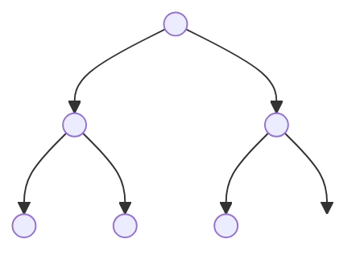

# Section 2: Heaps

A **heap** is a data structure which can be used to maintain a set of data with insertions and deletions so that we always have access to the least or greatest element, where elements are compared by their **priority**. For this reason, heaps are almost always directly associated with the **priority queue** ADT.

## Motivation: Priority Queues
A priority queue allows us to retrieve and dequeue the element of a dynamic set with the highest (or lowest) priority. Here is the API:

- `PriorityQueue()`: Initialize an empty priority queue
- `insert(k)`: Insert the element `k` into the priority queue
- `dequeue()`: Retrieve and remove the element of the greatest priority
- `peek()`: Retrieve but _do not_ remove the element of the greatest priority
- `update(k, x)`: Replace the element `k` with `x`

There are a number of implementations for priority queues in across different languages. Unfortunately, there is not a standard set of terms for the operations above (some even many more operations). For simplicity, we'll stick with the terms above, but you may want to check out similar implementations in [Python](https://docs.python.org/3/library/heapq.html) and [Java](https://docs.oracle.com/javase/8/docs/api/java/util/PriorityQueue.html) or others.

### Naive Approach
Our previous implementation of the queue ADT was efficient because it was relatively easy to maintain the entire data set in order using a linked list: as new data came in, we simply added it to the end of the list.

For priority queues, we don't know where in our queue new data belongs. It could have a very high priority or very low. Each time we insert an element, we need to figure out exactly where in the queue it belongs. If we continue using the linked list implementation, we'd have to search through all the nodes of the list until we found where to put the element. That means each insertion has time complexity $O(n)$: not excellent!

Here's a simple implementation of a priority queue using a linked list in Python:

```python
class Node:
    def __init__(self, data, priority):
        self.data = data
        self.priority = priority
        self.next = None

class LinkedListPQ:
    def __init__(self):
        self.head = None

    def insert(self, data, priority):
        new_node = Node(data, priority)
        if not self.head or self.head.priority < priority:
            new_node.next = self.head
            self.head = new_node
        else:
            current = self.head
            while current.next and current.next.priority >= priority:
                current = current.next
            new_node.next = current.next
            current.next = new_node

    def dequeue(self):
        if not self.head:
            raise IndexError("dequeue from an empty priority queue")
        highest_priority_node = self.head
        self.head = self.head.next
        return highest_priority_node.data

    def peek(self):
        if not self.head:
            raise IndexError("peek from an empty priority queue")
        return self.head.data

    def update(self, data, new_data, new_priority):
        current = self.head
        prev = None
        while current and current.data != data:
            prev = current
            current = current.next
        if not current:
            raise ValueError(f"{data} not found in the priority queue")
        if prev:
            prev.next = current.next
        else:
            self.head = current.next
        self.insert(new_data, new_priority)
```
<br/>

## Binary Heaps

Binary heaps help us solve the problem in the motivating example above by storing data that is "kind of" ordered, but not completely. At any given moment, the element of the highest priority is at the top of the heap; when it is popped off, the next highest element will be relatively easy to compute. We can achieve this using a binary tree with a specific ordering:

<div style="border: 1px solid black; background-color: rgba(255, 0, 0, 0.1); padding: 10px;">
    <strong>Definition 2.2.1</strong><br>
    <strong>Binary Heap</strong>: A complete binary tree that satisfies the heap condition.
</div>

<br/>

A complete binary tree is a tree in which every node has exactly two children (except, obviously, the ending nodes). In this case, we also make an exception that the bottom row may not be completely filled out. Here is an example:

