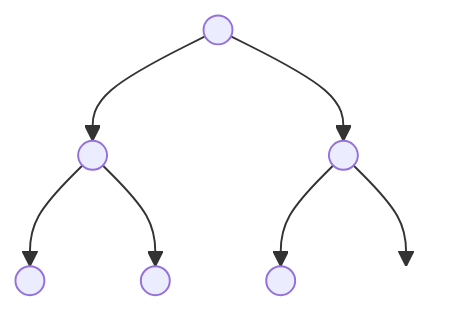
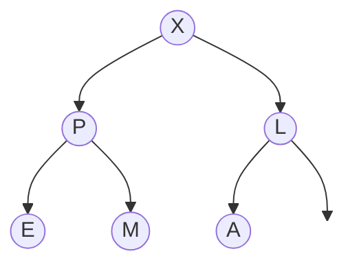
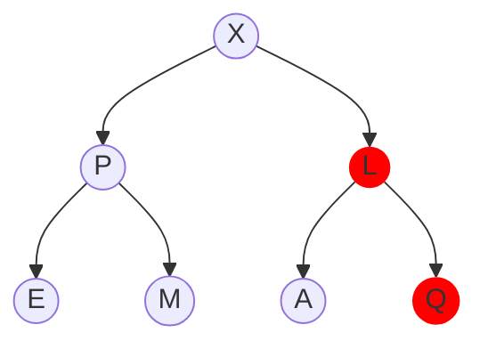
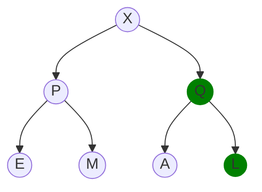
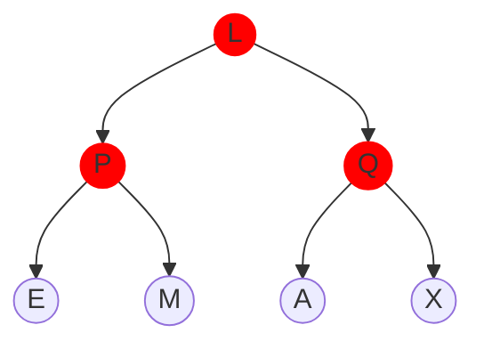
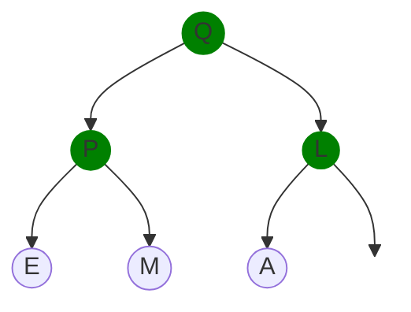

# Section 2: Heaps

A **heap** is a data structure which can be used to maintain a set of data with insertions and deletions so that we always have access to the least or greatest element, where elements are compared by their **priority**. For this reason, heaps are almost always directly associated with the **priority queue** ADT.

## Motivation: Priority Queues
A priority queue allows us to retrieve and dequeue the element of a dynamic set with the highest (or lowest) priority. Here is the API:

- `PriorityQueue()`: Initialize an empty priority queue
- `insert(k)`: Insert the element `k` into the priority queue
- `dequeue()`: Retrieve and remove the element of the greatest priority
- `peek()`: Retrieve but _do not_ remove the element of the greatest priority
- `update(k, x)`: Replace the element `k` with `x`

There are a number of implementations for priority queues in across different languages. Unfortunately, there is not a standard set of terms for the operations above (some even many more operations). For simplicity, we'll stick with the terms above, but you may want to check out similar implementations in [Python](https://docs.python.org/3/library/heapq.html) and [Java](https://docs.oracle.com/javase/8/docs/api/java/util/PriorityQueue.html) or others.

### Naive Approach
Our previous implementation of the queue ADT was efficient because it was relatively easy to maintain the entire data set in order using a linked list: as new data came in, we simply added it to the end of the list.

For priority queues, we don't know where in our queue new data belongs. It could have a very high priority or very low. Each time we insert an element, we need to figure out exactly where in the queue it belongs. If we continue using the linked list implementation, we'd have to search through all the nodes of the list until we found where to put the element. That means each insertion has time complexity $O(n)$: not excellent!

Here's a simple implementation of a priority queue using a linked list in Python:

```python
class Node:
    def __init__(self, data, priority):
        self.data = data
        self.priority = priority
        self.next = None

class LinkedListPQ:
    def __init__(self):
        self.head = None

    def insert(self, data, priority):
        new_node = Node(data, priority)
        if not self.head or self.head.priority < priority:
            new_node.next = self.head
            self.head = new_node
        else:
            current = self.head
            while current.next and current.next.priority >= priority:
                current = current.next
            new_node.next = current.next
            current.next = new_node

    def dequeue(self):
        if not self.head:
            raise IndexError("dequeue from an empty priority queue")
        highest_priority_node = self.head
        self.head = self.head.next
        return highest_priority_node.data

    def peek(self):
        if not self.head:
            raise IndexError("peek from an empty priority queue")
        return self.head.data

    def update(self, data, new_data, new_priority):
        current = self.head
        prev = None
        while current and current.data != data:
            prev = current
            current = current.next
        if not current:
            raise ValueError(f"{data} not found in the priority queue")
        if prev:
            prev.next = current.next
        else:
            self.head = current.next
        self.insert(new_data, new_priority)
```
<br/>

## Binary Heaps

Binary heaps help us solve the problem in the motivating example above by storing data that is "kind of" ordered, but not completely. At any given moment, the element of the highest priority is at the top of the heap; when it is popped off, the next highest element will be relatively easy to compute. We can achieve this using a binary tree with a specific ordering:

<div>
<p style="border: 1px solid black; background-color: rgba(255, 0, 0, 0.1); padding: 10px;">
<strong>Definition 2.2.1</strong><br/>
<strong>Binary Heap</strong>: A complete binary tree that satisfies the heap condition.
</p>
</div>

<br/>

A complete binary tree is a tree in which every node has exactly two children (except, obviously, the ending nodes). In this case, we also make an exception that the bottom row may not be completely filled out. Here is an example:



<br/>

By **heap condition** we mean that every node is larger than both of its two children. A binary tree that satisfies this condition is **heap ordered**.


<br/>

### Heap Structure
Because heaps are complete binary trees, it is easy to represent them as an array, starting with the root of the tree and proceding layer-by-layer, left-to-right. The above example would become:

| 0 | 1 | 2 | 3 | 4 | 5 | 6 |
|---|---|---|---|---|---|---|
|   | X | P | L | E | M | A |

Then, the parent of the $i$-th node is given by `i // 2` and the childrent of the $i$-th node are `2 * i` and `2 * i + 1`. Note that, to make the math work, we skip the 0<sup>th</sup> index.

<div>
<p style="border: 1px solid black; background-color: rgba(255, 0, 0, 0.1); padding: 10px;">
<strong>Note 2.2.1</strong><br/>
The element with the greatest priority is always located at the top of the heap (i.e. in index 1).
</p>
</div>

### Keeping the Heap in Order
#### Insertions
Let's say that we wanted to add the letter "Q" to our example heap. There's really only one place we could add it: at the end of the array. Thus our heap would become:


<br/>

That's a problem, because now we've violated the heap condition: Q is larger than its parent, L. We can fix this problem by performing a "float" operation. To float a node, we compare it with its parent and, if it is larger, swap the node with the parent. One iteration of that operation would yield


Now, we're okay, because Q is smaller than its parent, X. Notice that, as we float Q up, we don't need to check the children on the other side of the node. In this example, by swapping L and Q, it is not possible that Q would be less than A (or whatever might have been over there) since Q is greater than L, so it must also be greater than all of its new children (which were themselves less than L, by the heap condition).

#### Dequeueing the Maximum

In the note above, we saw that the maximum is _always_ located at the root of the tree, so it is relatively easy to identify. _But_ if we simply remove the key, we'll end up with two independent trees and no root. That would be a problem.

Instead, we _swap_ the root with the element at the bottom right of the tree (in this case "L") where it can be removed without disrupting the structure of the tree. Here's what that looks like:



Now, we can simply remove and return X. But there's a problem, as you might have guessed from all the red: the L is out of position. We can solve this by performing a "sink" operation to push L down to its correct position. This can be done by swapping L with the greater of its two children until it is greater than both.

In this example, we swap Q and L:



Now, L is smaller than its only child, A. We only performed one swap here, but it could have been several more. In any case, at this point, the heap condition is restored.

### Min vs. Max Priority Queues

In the above examples, it was the maximum element we were interested in. However, we might have prefered the _minimum_ element instead. This is common in something like a task scheduler that links the most important next jobs with _low_ priority (e.g. "priority #1"). We don't really need to make many adjustments; we can simply sink larger priority elements and float the lower.

## Code Implementation

It is a good exercise to write out the code for a Priority Queue using binary heaps yourself. The implementation of the PriorityQueue ADT (both min and max) used in the `friendsbalt` package can be found in [PQ.py](./pq.py). Note that this is just _one_ implementation--others may appear totally different, even while creating the identical structure.