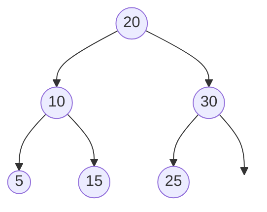
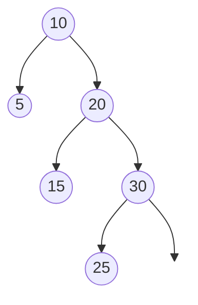

# Binary Search Trees

In this section, we are going to consider another implementation of symbol tables, **Binary Search Trees**. A Binary Search Tree (BST) provides much of the same functionality as a hash map when require the ability to perform _ordered_ operations on the data.

Here is a sample API of our _Ordered Mapping_ ADT:

- `insert(key, value)`: Inserts a key-value pair into the tree
- `get(key)`: Gets the value associated with the key
- `__len__()`: Returns the size of the tree
- `delete(key)`: Deletes a given key from the tree
- `min()`: Returns the minimum value in the tree
- `max()`: Returns the max value in the tree
- `inorder()`: Returns the key-value pairs sorted by key
- `floor(key)`: Returns the largest element less than the given key.
- `ceil(key)`: Returns the smallest element greater than the given key.

<strong>Definition 2.3.1</strong> 
A <strong>Binary Search Tree</strong> is a binary tree such that for each node all nodes in the left sub-tree are less than or equal to it and all nodes in the right subtree are greater than or equal.

 

It is an important corollary of this definitiont that each sub-tree (i.e. the tree rooted at any node) is also a binary tree. Thus, it will be possible to write succinct recursive functions for most of the functions listed above.

Here is an example tree:

This is a nicely balanced tree, but it could be much less symetrical. Here's the identical data in a less-nice form

