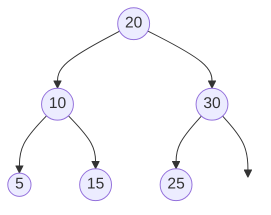
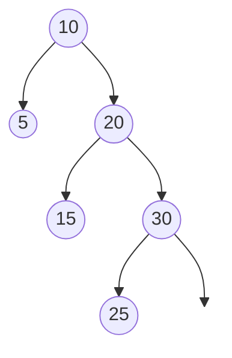

# Binary Search Trees

In this section, we are going to consider another implementation of symbol tables, **Binary Search Trees**. A Binary Search Tree (BST) provides much of the same functionality as a hash map when require the ability to perform _ordered_ operations on the data.

Here is a sample API of our _Ordered Mapping_ ADT:

- `insert(key, value)`: Inserts a key-value pair into the tree
- `get(key)`: Gets the value associated with the key
- `__len__()`: Returns the size of the tree
- `delete(key)`: Deletes a given key from the tree
- `min()`: Returns the minimum value in the tree
- `max()`: Returns the max value in the tree
- `inorder()`: Returns the key-value pairs sorted by key
- `floor(key)`: Returns the largest element less than the given key.
- `ceil(key)`: Returns the smallest element greater than the given key.

<div>
<p style="border: 1px solid black; background-color: rgba(255, 0, 0, 0.1); padding: 10px;">
<strong>Definition 2.3.1</strong><br/>
A <strong>Binary Search Tree</strong> is a binary tree such that each node is greater than or equal to all nodes in its left subtree and less than or equal to all nodes in the right subtree.
</div>

<br/>

It is an important corollary of this definitiont that each sub-tree (i.e. the tree rooted at any node) is also a binary tree. Thus, it will be possible to write succinct recursive functions for most of the functions listed above.

Here is an example tree:



This is a nicely balanced tree, but it could be much less symetrical. Here's the identical data in a less-nice form


<br/>
<br/>

Note that the above diagrams only show the keys. In our implementation, each node also contains an implicit value. There are no restrictions on what the value can be. However, since the BST requires ordered operations, the keys must be compatible with `<`.

## Basic Structure

To implement this data structure, we define a `Node` class such that each node has a key, value, and left and right children:

```python
class Node:
    def __init__(self, key, value, left=None, right=None):
        self.key = key
        self.value = value
        self.left = left
        self.right = right
```

## Search Operations
Let's look at some of the operations for retrieving data from the tree:

### Get a Specific Key

```python
def get(self, key):
    # Retrieve the value associated with the given key.
    return self._get(key, self.root)

def _get(self, key, node):
    # Retrieve the key, starting search from a given node.

    if node is None: return None # Search miss
    if key < node.key: return get(key, node.left) 
    if key > node.key: return get(key, node.right)
    
    return node.value # Search hit
```
The `get(key)` algorithm relies on the assertion above that each node is the root of another (strictly smaller) binary subtree. That enables us to perform the search recursively: searching for a key starting at the root is identical to searching either the left or right subtree. So, at each stage, all we need to do is figure out if our key is bigger or smaller and search the corresponding subtree.

### Get the Minimum
We again use a recursive algorithm based on the assertion that the minimum element in the tree is in the minimum element in the left subtree.
```python
def min(self):
    return self._min(self, self.root)

def _min(self, node):
    if node.left is None: return self.value
    return self._min(node.left)
```

In general, we'll continue using the recursive version of these algorithms because they are ultimately simpler to write and debug (and prove the correctness of if you're into that sort of thing). However, there iterative solution is just as correct:

```python
def min(self):
    currrent = self.root
    while current.left is not None:
        current = current.left
    return current.value

```

### Sorting the Tree
Relying again on the structure of the tree we know that at any node $x$, (1) all nodes to the left of $x$ are less than or equal to $x$ and all nodes to the right greater or equal. Hence, to order all of the nodes, we would first order all of the nodes on the left, append $x$, and finally append the ordering of all the nodes on the right. As the name suggests, this path through the tree is known as _in order traversal_ (we'll see some other kinds in the next unit).

```python
def inorder(self):
    result = []
    self._inorder(self, root, result)
    return result

def _inorder(self, node, order):
    if node is None: return

    self._inorder(node.left)
    order.append(node.value)
    self._inorder(node.right)
```

### Computing the Floor

The floor of a key refers to the largest node in the BST less than or equal to the given key. You can think of it as generalization of "rounding down" to the nearest in-tree item.

The strategy for searching for a floor is very similar to get:

1. If the root of the tree is `None`, return `None`
2. If the root _is_ the key, return the key.
3. Otherwise if the key searched for is smaller than the root, then the floor must occur in the left subtree.
4. Conversely, if the key is greater than the current node, then either the current node is the floor _or_ there is a floor in the right subtree that is strictly greater than the current node.

Here's what that looks like in code:

```python
def floor(self, key):
    return self._floor(key, self.root)

def _floor(self, key, node):
    if node is None: return None

    if key == node.key: return key
    if key < node.key return self._floor(key, node.left)
    if key > node.key:
        fl = self._floor(key, node.right)
        if fl is not None return fl.key
        return node.key
```

## Assignment

Write the functions for `max()` and `ceil(key)` which return the max element in the tree and the ceiling of a given key (smallest element greater than `key`).