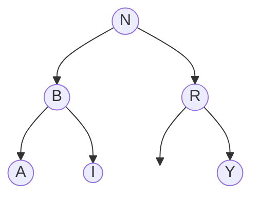
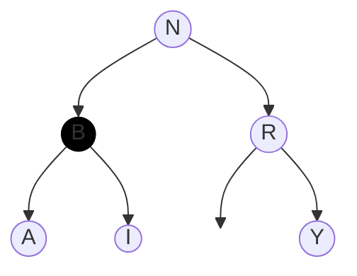
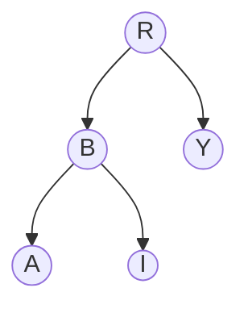
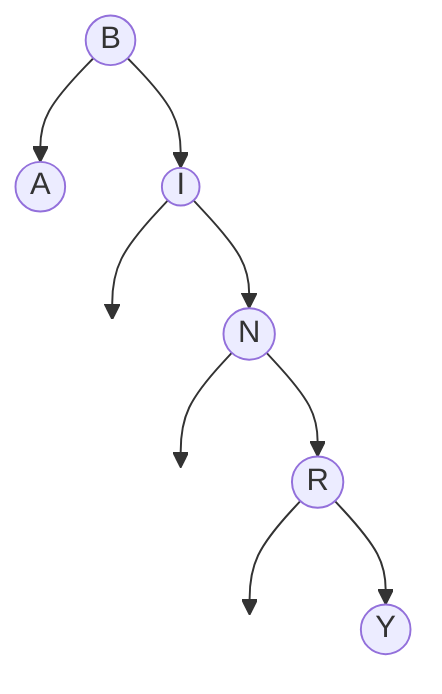

# Binary Search Trees (pt. II)

In the previous section, we saw how the structure of a binary search tree could be used to easily search for data contained within it. Since binary trees are dynamic, we also need the ability to efficiently maintain additions and deletions to the tree without violating the binary tree property.

## Maintaining the BST

To keep things simple, our tree will support only insertions and deletions of keys. Neither of these operations require a return value; however, you will notice that the recursive functions we write do. This is because the insert and delete operations alter the structure of the tree. To maintain the structure, we require these maintenance methods to return the new root of the tree (or subtree) so that we can adjust the structure on the way up the recursive calls.

### Inserting a key

We're going to adopt a very simple strategy almost identical to the get operation. We simply traverse the tree until we find the key we want, in which case we update the value, or we hit an empty link, in which case we add a new key to the tree.

```python
def create_node(self, key, value):
    return BSTNode(key,value)
    
def put(self, key, value):
    self.root = self._put(key, value, root)

def _put(self, key, value, node)
    if node is None: return self.create_node(key, value)

    if key == node.key:
        node.value = value
    if key < node.key:
        node.left = self._put(key, value, node.left)
    if key > node.key:
        node.right = self._put(key,value, node.right)
    
    return node
```
Note that the recursive `_put()` method always returns the root of the (sub)tree with the given key and value added. That will either be the current node if it isn't `None` or a new node if it is. It may seem a bit odd to return the current node every time. However, because `_put()` always returns the correct root whether that's a new node or an ixisting one we can simply update the left or right link using `node.left = self._put(key, value, node.left)` without having to handle the two cases separately. It also provides some symmetry with the delete operation.

### Deleting a Node

Deleting a node can be somewhat tricky. Before we examine the strategy, let's look at a visual example:



Some deletions in this tree are easy. For example `delete(Y)` would be as simple as setting `R.right = None`. Similarly, `delete(R)` could be accomplished by setting `N.right = Y`.

But how could we accomplish something like `delete(B)`? In the example above, we could just put `I` in the slot where `B` currently is. But what if `I` has its own children already (perhaps not shown in the diagram)? The problem with deleting a node with children is that neither child can simply take over the position without disrupting the structure of its own subtree.

One solution is to simply mark the node as "dead" but leave it in the tree:



That works kind of well if there aren't too many deletions. Over time, however, the number of dead nodes will add up and slow down our implementation, so this isn't the best solution. We'd also have to edit all of our search code from the last lesson to exclude "dead" nodes.

A more effective solution was invented in 1962 by Thomas Hibbard. In short, we simply swap the node to be deleted with its successor (i.e. the next node in order).

If we wanted to perform `delete(N)`, that would like this:


The successor of an element is always the minimum element of the right subtree, so it cannot have a left element. Since this element has only one child, it's easy to delete by replacing it with its child.



Here's one implementation in code:

```python
def delete(self, key):
    root = self._delete(self,key, root)

def _delete(self, key, node):
    if node is None:   return None
    if key < node.key: return self._delete(key, node.left)
    if key > node.key: return self._delete(key, node.right)

    #Key match
    if node.left is None:  return node.right
    if node.right is None: return node.left

    successor = self.min(node.right)
    node.key, node.value = successor.key, successor.value
    node.right = self._delete(successor.key, node.right)

    return node
```

This is the most common way to handle the swapping, but you'll notice that all that's swapped are the _contents_ of the node. For the most part this isn't going to be a problem, but it does make our tree a little less generalizable. If we wanted our nodes to have a more complex structure (other than just keys and values), we'd need to modify our code to include this. Additionally, if a client maintains references to the nodes themselves, this swapping would break them. For that reason, some implementations prefer an implementation that actually swaps the successor node for the deleted.

```python
def _delete(self, key, node):
    if node is None:   return None
    if key < node.key: return self._delete(key, node.left)
    if key > node.key: return self._delete(key, node.right)

    #Key match
    if node.left is None:  return node.right
    if node.right is None: return node.left

    temp = node
    node = self.min(temp.right)
    node.right = self._delete_min(temp.right)
    node.left = temp.left

    return node
```

## Shortcomings of BSTs
Recall the advantage of using binary search over sequential search: the former runs in $O(\log(n))$ time. We achieved this by using a sorted array. Of course, a sorted array is challenging to maintain since insertions often require shifting the elements. The structure of a BST, however, means that we can easily identify a better search position by moving just one link without having the rigidity of an array. But, while an array guarantees that each step of the search eliminates half of the array, we have no such guarantee on binary trees.

For instance, most of the operations above contain some search code similar to these:

```python
if key < node.key: do_something(node.left)
if key > node.key: do_something(node.right)
```

The hope is that each recursive operation will be called on a subtree roughly half the size on average, but there's no guarantee! Since the structure of the tree is based on the order of insertions, some trees will be better than others. In the examples above, we've been using the letters in the word "BINARY." If we built the tree in the order the letters appear in the word, the tree would look like this:


Clearly, steps along this tree do not cut the remaining nodes in half. In fact, every set of letters has a tree construction that is no better than a linked list.

In general, here is the time complexity for search operations in the tree:

| Case        | Runtime         |
|-------------|-----------------|
| Worst Case  | $n$          |
| Best Case   | $\log n$     |
| Average Case| $1.39\log n$ |

We won't prove that last part, but it is worth noting that the average case is significantly slower than regular binary search by a factor of $1.39$. In the next lesson we'll see some ways to improve things.

## Assignment

1. Write the `_del_min(self, node)` function used in Hibbard deletion above to delete the minimum of a given tree.

2. Build a couple of binary trees based on the letters in "COMPUTER". What are the best and worst cases for the letter order? What order is needed generally (i.e. for any word) to achieve the best or worst case?

3. We solved a similar worst case problem for quicksort by shuffling the inputs first. Why wouldn't that work here (even if we only want the average case runtime)?