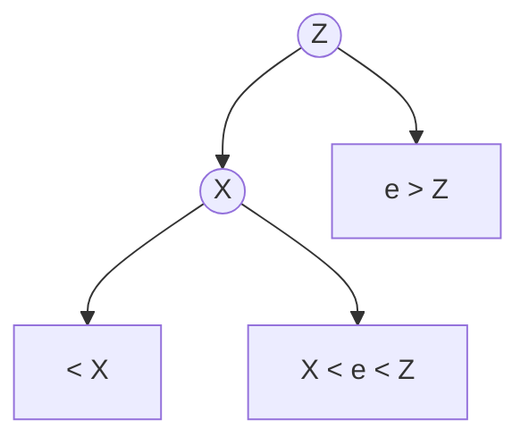
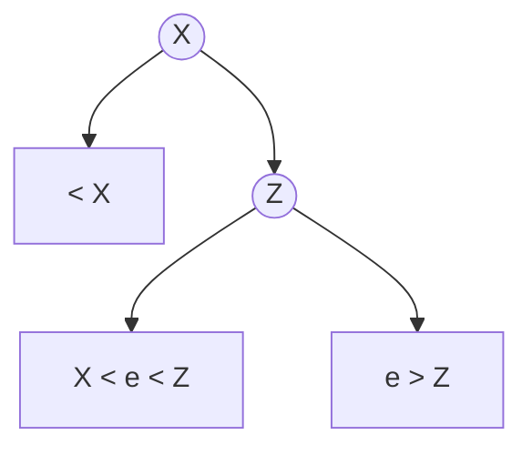
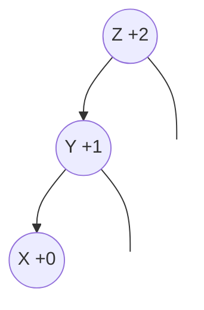
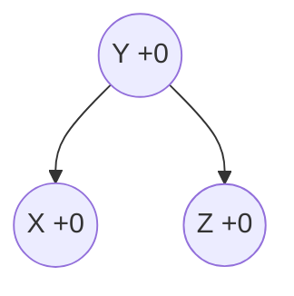
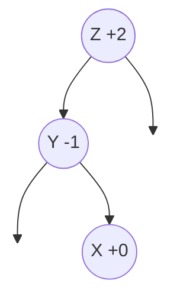
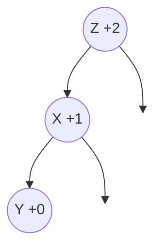
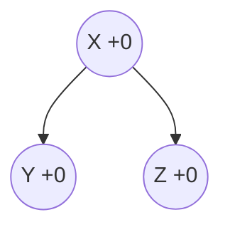
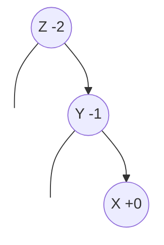
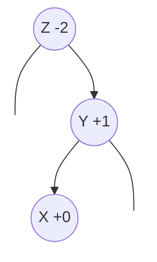

# Balanced Search Trees
In the previous lesson, we saw that BSTs are susceptible to linear worst-case times (compared to logarithmic in array-based binary search) and a constant proportional slow-down on average. The cause was the potential for _unbalanced nodes_. In this lesson, we'll look at one approach to balancing trees.

## Node Balance

The ideally balanced BST would be something like a complete binary tree where each node is the exact median of the left and right subtrees (i.e. the two subtrees have the identical number of nodes). Maintaining such a structure under arbitrary insertions and deletions would be pretty hard, and, it turns out, completely unnecessary.

Instead of balancing the _number_ of nodes in the two subtrees, we instead focus on the _height_, which is the maximum number of steps from the root to any leaf node. We achieve this by augmenting our `BSTNode` class to keep track of its height:

```python
class AVLNode(BSTNode):
    def __init__(self, key, value):
        super().__init__(key, value)
        height = 1
```

Then, we define the balance factor of any given node to be the difference the heights of the right and left subtrees. We say that a node is balanced if the balance factors of the left and right subtrees is between $-1$ and $1$.

This works because it minimizes the worts-case search time by limiting the number of _steps_ we need to take to reach the bottom of the tree. This is what we're really concerned about anyway and it turns out to be _much_ easier to maintain than the _number_ of elements in the two trees.

## Balancing Nodes

This strategy of keeping balanced nodes by heights was invented in 1962 by Georgy Adelson-Velsky and Evegenii Landis and is known as an **AVL Tree**.

The aim of this tree--and any balanced BST--is to keep the search operations consistent with ordinary BSTs while also keeping the structure of the tree balanced. In AVL trees, we achieve this by performing a normal `put()` operation which may cause temporary un-balance in the tree. Then, we perform a number of local rearrangements to restore the balance condition.

### Rotations

There are only two rearranging operations used in AVL trees: right and left rotations. Both of these oprations preserve the "horizontal order," of the tree--that is, they have the same `inorder` traversal.

The following is the process for a right rotation:

Let $Z$ be the root of a tree (or subtree) and $X$ be the left child of $Z$. Let $Z_l$ and $X_r$ be the left and right children of $Z$ and $X$.

A right rotation is performed with the following steps

$t = X_r$
$X_r = Z$
$Z_l = t$
Return $X$ as the new root

This operation preserves the horizontal order because none of the steps violate the ordering of a BST.

For example, setting $X_r = Z$ is allowed because $X$ was originally the left child of $Z$, so all the elements $e$ of the subtree rooted at $X$ are already less than or equal to $Z$. The diagram below illustrates the order preservation of this rotation.

#### Before Rotation


#### After Rotation



A **left rotation** occurs through a similar process:

Let $X$ be the _right_ child of $Z$.

$t = X_l$
$X_l = Z$
$Z_r = t$
Return $X$ as the new root

As an exercise, draw the before and after of the rotation and show that it preserves the horizontal order of the tree.

### Balancing AVL Nodes

Nodes of an AVL tree become unbalanced only when a node is inserted or deleted. The process is more or less the same for insertions and deletions, so we'll suppose we're adding a node in this case. When a node is added and one of its ancestors $Z$ becomes unbalanced as a result (its balance factor becomes $2$ or $-2$), there are four possibilities:

#### Left-Heavy Node (type I)
In this case, a node is added somewhere in the left subtree of the left child of the root. Since this is a recursive operation, we assume that at this point all the lower subtrees have been balanced.


In this case, we can easily rebalance the tree with a right rotation:


Notice that the balance factor is restored to $0$ for all nodes! It is worth taking a second to convince yourself of this: as an exercise, show that a right rotation in this scenario results in perfect balance.

#### Left-Heavy Node (type II)

In this scenario, a new node is added to the _right_ child of the left subtree:



Here, a right rotation isn't going to fix the problem. _But_ we can perform a _left_ rotation on node $Y$:



Now we're in the same type I left-heavy situation, so we can simply perform a right rotation on $Z$:



#### Right-Heavy Node (type I)
This is the symmetric case of the type-I left-heavy node:



This is solved with a _left_ rotation.

#### Right-Heavy Node (type II)
This is the symmetric case of the type-II left-heavy node:



## Implementation in Code

```python
class AVLTree(BST):
    def __init__(self):
        self.root = None

    def create_node(self, key, value):
        return AVLNode(key, value)

    def _height(self, node):
        return node.height if node else 0
    
    def _balance_factor(self, node):
        return self._height(node.left) - self._height(node.right)

    def _put(self, key, value, node):
        if not node: return self.create_node(key, value)

        if key < node.key:
            node.left = self._put(key, value, node.left)
        elif key > node.key:
            node.right = self._put(key, value, node.right)

        node.height = 1 + max(self._height(node.left), self._height(node.right))

        balance = self._balance_factor(node)

        # Left Heavy
        if balance > 1 and key < node.left.key:
            return self._rotate_right(node)
        # Right Heavy
        if balance < -1 and key > node.right.key:
            return self._rotate_left(node)
        # Left-Right Case
        if balance > 1 and key > node.left.key:
            node.left = self._rotate_left(node.left)
            return self._rotate_right(node)
        # Right-Left Case
        if balance < -1 and key < node.right.key:
            node.right = self._rotate_right(node.right)
            return self._rotate_left(node)
        
        return node 
```